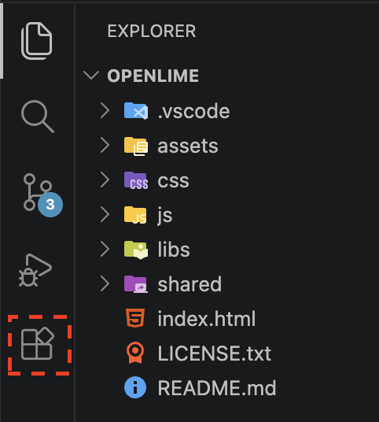
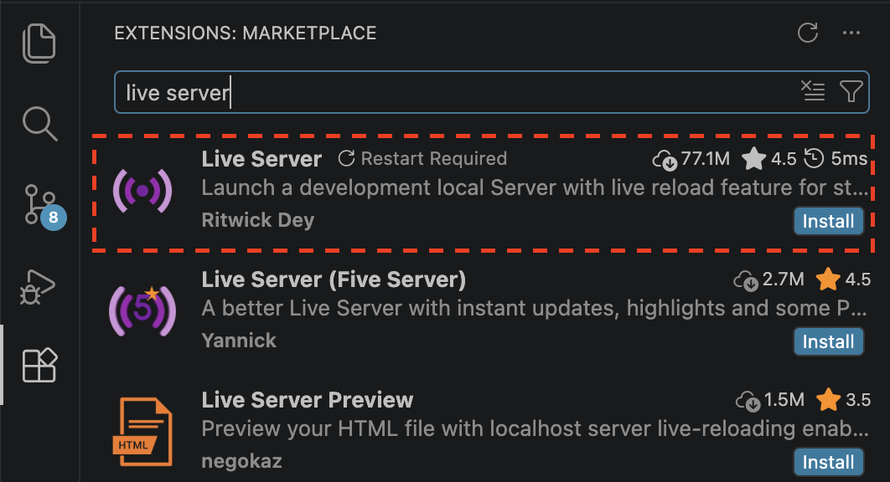
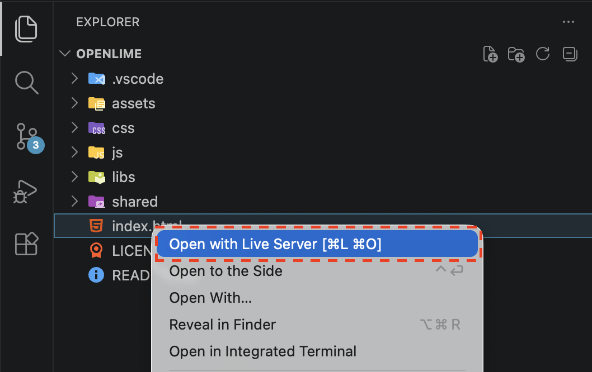
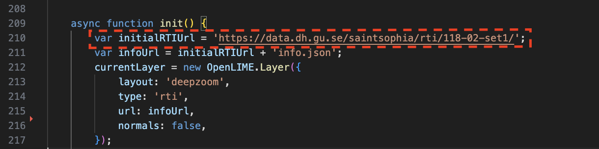

# OpenLIME (Open Layered IMage Explorer)

  

**OpenLIME** (*Open Layered IMage Explorer*), is an open, scalable, and flexible framework for creating web-based interactive tools to annotate and inspect large multi-layered and multi-channel standard and relightable image models. 

**OpenLIME** is jointly developed by [CRS4 Visual and Data-intensive Computing Group](https://www.crs4.it/en/research-and-development-sectors/vidic/) and [CNR ISTI - Visual Computing Lab](http://vcg.isti.cnr.it/). 

## Getting Started
Install Visual Studio Code and drag in the unzipped folder.

1. Click the extensions tab on the left toolbar.

2. Search for and then install the [Live Server](https://marketplace.visualstudio.com/items?itemName=ritwickdey.LiveServer) plug-in.

3. Right-click on the `index.html` file and select **Open with Live Server**.

Your browser will automatically open the application.

Change the RTI by adjusting this line in index.html.

